# 6、使用命令

这一章将介绍以下命令：

- `type` -- 说明怎样解释一个命令名
- `which` --显示会执行哪个可执行程序
- `man` --显示命令手册页
- `apropos` --显示一系列适合的命令
- `info` --显示命令info
- `whatis` --显示一个命令的简洁描述
- `alias` --创建命令别名

## 6.1 到底什么是命令？

命令可以是下面四种形式之一：

1. 是一个可执行程序，就像我们看到的位于目录 `/usr/bin`中的文件一样。这一类程序可以是诸如 `C和C++`语言写成的程序编译的二进制文件、也可以是由诸如 `shell、perl、python、ruby`等脚本语言写成的程序。
2. 是一个内建于 `shell` 自身的命令。`bash` 支持若干命令，内部叫做 `shell` 内部命令（builtins）。
3. 是一个 `shell` 函数。这些是小规模的 `shell` 脚本，它们混合到环境变量中。
4. 是一个命令别名。我们可以定义自己的命令，建立在其他命令之上。

## 6.2 识别命令

这经常很有用，能确切地知道正在使用四类命令中的哪一类。`Linux` 提供了一堆方法来弄明白命令类型。

## 6.3 type - 显示命令的类型

`type` 命令是 `shell` 内部命令，，它会显示命令的类别，给定一个特定的命令名 （作为参数）。如：

```shell
type command
```

`command` 是你要检测的命令名，如：

```sh
type type

type ls

type cp
```

## 6.4 which - 显示一个可执行程序的位置

为了确定所给定的执行程序的准确位置，使用 `which` 命令：

```sh
which ls
```

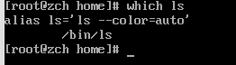

这个命令只对可执行程序有效，不包括内建命令和命令别名，别名是真正的可执行程序的替代物。

## 6.5 help - 得到shell内建命令的帮助文档

输入 `help` 然后紧接着命令名：

```sh
help cd
```

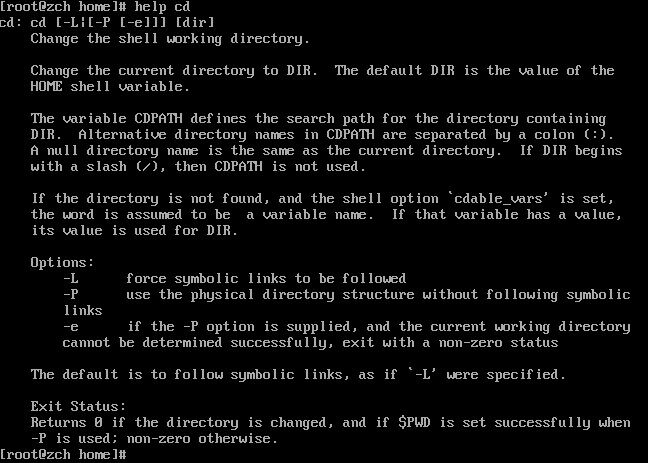

这里注意表示法，出现在命令语法说明中的方括号，表示可选的项目。一个竖杠字符表示互斥选项。

```sh
cd [-L|[-P [-e]]] dir
```

## 6.6 --help - 显示用法信息

```sh
mkdir --help
```

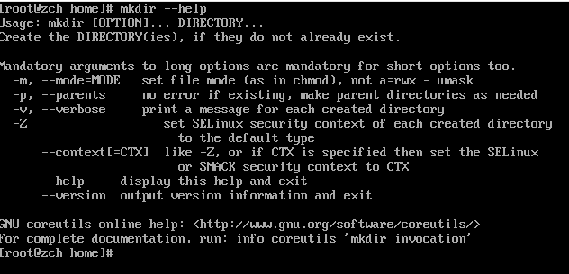

## 6.7 man - 显示程序手册页

许多希望被命令行使用的可执行程序，提供了一个正式的的文档，叫做手册或手册页（man page）。一个特殊的叫做 `man` 的分页程序，可用来浏览他们。他是这样使用的：

```sh
man program
```

`paogram`是要浏览的用户名

```sh
man ls
```

## 6.8 apropos - 显示适当的命令

也有可能搜索参考手册列表，基于某个关键字的匹配项。

```sh
apropos floppy
```

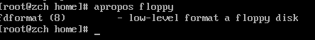

输出结果每行的第一个字段是手册页的名字，第二个字段展示章节。注意，`man`命令加上 `-k`选项，和 `apropos` 完成一样的功能。

## 6.9 whatis - 显示非常简洁的命令说明

`whatis` 程序显示匹配特定关键字的手册页的名字和一行命令说明。

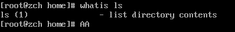

## 6.10 info - 显示程序 info 条目

`info` 内容可通过 `info` 阅读器程序读取。`info` 页是超级链接形式的，和网页很相似。

info 程序读取 info 文件，info 文件是树型结构，分化为各个结点，每一个包含一个题目。 info 文件包含超级链接，它可以让你从一个结点跳到另一个结点。一个超级链接可通过它开头 的星号来辨别出来，把光标放在它上面并按下 enter 键，就可以激活它。 输入 “info”，接着输入程序名称，启动 info。下表中的命令，当显示一个 info 页面时，用来 控制阅读器。

| 命令              | 行为                                          |
| ----------------- | --------------------------------------------- |
| ?                 | 显示命令帮助                                  |
| PgUP or Backspace | 显示上一页                                    |
| PgDn or Space     | 显示下一页                                    |
| n                 | 下一个 - 显示下一个结点                       |
| p                 | 上一个 - 显示上一个结点                       |
| u                 | Up - 显示当前所显示结点的父结点，通常是个菜单 |
| Enter             | 激活光标位置下的超链接                        |
| q                 | 退出                                          |

到目前位置，我们讨论的大多数命令行程序，属于GUN项目 `coreutils` 包中的各个程序。

```sh
info coreutils
```

## 6.11 READEME 和其他程序文档

许多安装在你系统中的软件，都有自己的文档文件，这些文件位于`/usr/share/doc` 目录下。这 些文件大多数是以文本文件的形式存储的，可用 less 阅读器来浏览。一些文件是 HTML 格式， 可用网页浏览器来阅读。我们可能遇到许多以 “.gz” 结尾的文件。这表示 gzip 压缩程序已经压 缩了这些文件。gzip 软件包包括一个特殊的 less 版本，叫做 zless，zless 可以显示由 gzip 压缩 的文本文件的内容。

## 6.12 使用 别名（alias） 创建你自己的命令

一个命令行小技巧：

```sh
command1; command2; command3...
```

如：

```sh
cd /usr; ls; cd -
```

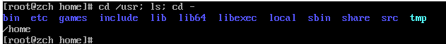

可以看到这三条命令按顺序执行了。我们可以将这三条命令创建一个别名。

比如创造一个 `foo` 命令，首先看下有没有这个命令：

```sh
type foo
```

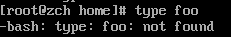

可以看到并没有这个命令，所以我们可以放心的创建。

```sh
alias foo='cd /usr; ls; cd -'
```

注意命令结构：`alias name='string'`

这个命令可以用在任何地方：

```sh
foo
```

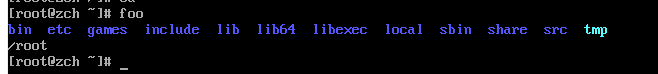

我们可以用 `type`查看我们的别名：

```sh
type foo
```

我们还可以删除别名，使用 `unalias`：

```sh
unalias foo

type foo
```

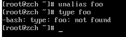

我们还可以使用不带参数的 `alias` 查看环境中的别名：

```sh
alias
```

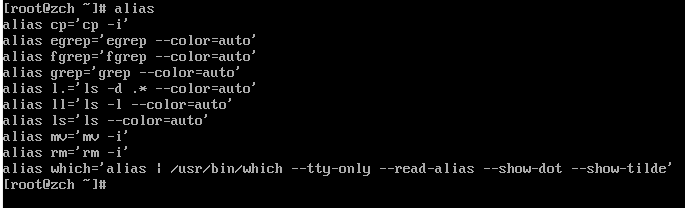

在命令行中定义别名有点儿小问题。当你的 shell 会话结束时，它们会消失。随后的章节里， 我们会了解怎样把自己的别名添加到文件中去，每次我们登录系统，这些文件会建立系统环境。

# 7、重定向

命令行中最酷的特性。它叫做 `I/O重定向`。通过这个工具，你可以将命令的输入来源以及输出低点重定向为文件。也可以把多个命令连接起来组成一个强大的命令管道。

- cat -- 连接文件
- sort -- 排序文本行
- uniq -- 报道或省略重复行
- grep -- 打印匹配行
- wc -- 打印文件中换行符，字，和字节个数
- head -- 输出文件第一部分
- tail -- 输出文件最后一部分
- tee -- 从标准输入读取数据，并同时写到标准输出和文件

## 7.1 标准输入、输出和错误

到目前为止，我们用到的许多程序都会产生某种输出。这种输出，经常由两种类型组成。第一， 程序运行结果；这是说，程序要完成的功能。第二，我们得到状态和错误信息，这些告诉我们 程序进展。如果我们观察一个命令，像 ls，会看到它的运行结果和错误信息显示在屏幕上。 与 Unix 主题“任何东西都是一个文件”保持一致，程序，比方说 ls，实际上把他们的运行 结果输送到一个叫做标准输出的特殊文件（经常用 stdout 表示），而它们的状态信息则送到另 一个叫做标准错误的文件（stderr）。默认情况下，标准输出和标准错误都连接到屏幕，而不是 保存到磁盘文件。除此之外，许多程序从一个叫做标准输入（stdin）的设备得到输入，默认情 况下，标准输入连接到键盘。

一般地，输出送到屏幕，输入来自键盘，但是通过I/O重定向，我们可以做出改变。

## 7.2 标准输出重定向

我们使用 `>` 重定向独好后接文件名将标准输出冲形象到除了屏幕以外的另一个文件。如：

```sh
ls -l /usr/bin > ls-output.txt
```

这里我们查看输出结果：

```sh
ls -l ls-output.txt
```

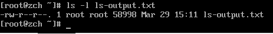

我们还可以通过 `less` 命令查看该文本文件：

```sh
less ls-output.txt
```

接下来，我们写入一个错误的目录到文件中：

```sh
ls -l /bin/bin > ls-output.txt
```

我们会收到一个错误信息，因为我们指定了一个不存在的目录，但是为什么错误信息会被显示在屏幕上呢？因为 `ls` 程序不把它的错误信息输送到标准输出，因为我们只是重定向了标准输出，并没有重定向标准错误。接下来我们看一下文件的变化：

```sh
ls -l ls-output.txt
```

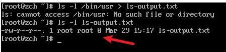

我们可以看到，文件长度为0！这是因为我们使用 `>` 重定向输出结果，目标文件总是开头被重写，因为 `ls` 没有输出结果，只有错误信息，所以重定向开始写文件时，由于错误而停止，自然就导致文件内容被清空了。**当我们需要清空一个文件内容或者创建一个新的空文件时，就可以使用这样的技巧**

```sh
 > ls-output.txt
```

那我们怎样将重定向结果追加到文件内容后面，而不是从开头开始重写文件？我们可以使用 `>>` 重定向符：

```sh
ls -l /usr/bin >> ls-output.txt
```

使用 `>>` 操作符，将导致输出结果添加到文件内容之后。如果文件不存在，将会创建。

```sh
ls -l ls-output.txt
```

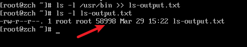

## 7.3 标准错误重定向

标准错误重定向没有专用的重定向操作符。为了重定向标准错误，我们必须参考其文件描述 符。一个程序可以在几个编号的文件流中的任一个上产生输出。虽然我们已经将这些文件流的 前三个称作标准输入、输出和错误，shell 内部分别将其称为文件描述符 0、1 和 2。shell 使用 文件描述符提供了一种表示法来重定向文件。因为标准错误和文件描述符 2 一样，我们用这种 表示法来重定向标准错误：

```sh
ls -l /bin/usr 2> ls-error.txt
```

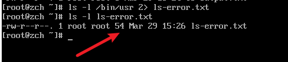

## 7.4 重定向标准输出和错误到同一个文件

可能有这种情况，我们希望捕捉一个命令的所有输出到一个文件。为了完成这个，我们必须同时重定向标准输出和标准错误。有两种方法：

### 7.4.1 第一种：

```sh
ls -l /bin/usr > ls-output.txt 2>&1
```

使用这种方法，我们完成两个重定向。首先重定向标准输出到文件 `ls-output.txt`，然后重定向文件描述符 2（标准错误）到文件描述符 1（标准输出） 使用表示法 `2>&1`。

注意重定向的顺序安排非常重要。标准错误的重定向必须总是出现在标准输出重定向之后，要不然不起作用。意思就是说如果将 `> ls-output.txt 2>&1` 改为 `2>&1 ls-output.txt`，则标准错误将重定向到屏幕。

### 7.4.2 第二种

```sh
ls -l /bin/usr &> ls-output.txt
```

在这里例子里，简单用一个表示法 `&>` 来重定向比早婚输出和错误到文件 `ls-output.txt`

## 7.5 处理不需要的输出

我们不想要一个命令的输出结果，只想把他们扔掉。这种情况尤其适用于错误和状态信息。系统通过重定向输出结果到一个叫做 `/dev/null`的特殊文件，为我们提供了解决问题的方法。这个文件是系统设备，叫做位存储桶，他可以接受输入，并且对输入不做任何处理。为了隐瞒命令出错误信息，我们这样做：

```sh
ls -l /bin/usr 2> /dev/null
```

## 7.6 标准输入重定向

到目前为止，我们还没有遇到一个命令是利用标准输入的，在下面的篇章...

## 7.7 cat - 连接文件

`cat` 命令读物一个或多个文件，然后赋值它们到标注输出，就像这样：

```sh
cat [file]
```

在大多数情况下，你可以认为 `cat` 命令相似于DOS的`TYPE`命令。你可以使用 `cat` 来显示文件而没有分页，例如：

```sh
cat ls-output.txt
```

如果 `cat` 没有任何参数，他会从标准输入读入数据，又因为标准输入连接到键盘，它正在等待我们的输入！:

```sh
cat

Now is my input.
```

下一步，按住 `ctrl + d`，来告诉 `cat`，在标准输入中，已经到文件末尾（EOF）。

由于没有文件名参数，`cat`复制标准输入到标准输出，所以我们看到文本行重复出现。我们可以使用这种行为来创建简短的文本文件。比如说我们要创建一个叫做 `input.txt`的文件，可以这样做：

```sh
cat > input.txt
```

然后输入内容，会写入到 `input.txt`中。

现在我们试一下`cat`怎么接收标准输入：

```sh
cat < input.txt
```

使用 `<` 操作符就可以将输入源变为 `input.txt`。

## 7.8 管道线

命令从标准输入读取数据并输送到标准输出的能力就被一个称为管道线的 `shell` 特性所利用。使用管道操作符 `|` ，一个命令的标准输出可以通过管道送至零一个命令的标准输入。

```sh
command1 | command2
```

来试试吧，配合 `less` 命令：

```sh
ls -l /usr/bin | less
```

我们用 `less` 来一页一页地显示任何命令地输出，命令把它的运行结果输送到标准输出。

## 7.9 过滤器

管道线经常用来对数据完成复杂地操作。有可能会把几个命令放在一起组成一个管道线。通常以这种方式使用的命令被称为过滤器。过滤器接受输入，以某种方式改变它，然后输出它。

我们先试验一下 `sort` 。想象一下，我们把目录 `/bin` 和 `usr/bin` 中的可执行程序都聚合在一起，再把他们排序，然后浏览执行结果。

```sh
ls /bin /usr/bin | sort | less
```

因为我们指定了两个目录，`ls`命令地输出结果由有序列表组成，各自针对一个目录。通过在管道线中包含 `sort`，我们改变输出数据，从而产生一个有序列表。

## 7.10 uniq - 报道或忽略重复行

`uniq` 命令经常和 `sort` 命令结合在一起使用。`uniq`从标准输入到单个文件名参数接受数据有序列表，默认情况下，从数据列表中删除任何重复行。所以，为了确信我们的列表中不包含重复句子（意思是说，出现在 /bin 和 /usr/bin 中重名地程序），我们添加 `uniq` 到我们地管道线中：

```sh
ls /bin /usr/bin | sort | uniq | less
```

我们通过 `uniq` 删除重复行，如果想看到重复地数据列表，我们可以加上 `-d` 选项：

```sh
ls /bin /usr/bin | sort | uniq -d | less
```

## 7.11 wc - 打印行数、字数和字节数

`wc`（字计数）命令用来显示文件所包含地行数、字数和字节数：

```sh
wc ls-output.txt
```

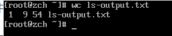

打印的三个数字分别是行数、单词数、字节数。

使用 `-l` 选项限制命令输出只能报道行数，添加 `wc` 到管道线统计数据，比如：

```sh
ls /bin /usr/bin | sort | uniq | wc -l
```

用来查看我们的有序列表中程序个数。

## 7.12 grep - 打印匹配行

`grep` 是一个很强大的程序，用来找到文件中的匹配文本。这样使用：

```sh
grep pattern [file...]
```

当 `grep` 遇到一个文件中的匹配模式，他会打印出包含这个类型的行。`grep` 能够匹配的模式可以很复杂，但是我们现在把注意力集中在简单文本匹配上。后续章节我们将会讨论正则表达式。

比如，我们想找到文件名中包含单词 `zip` 的所有文件。这样做：

```sh
ls /bin /usr/bin | sort |uniq | grep zip
```

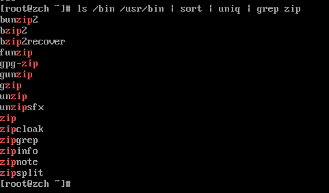

`-i` 选项可以在在执行过程中忽略大小写。`-v` 可以纸打印不匹配的行。

## 7.13 head / tail - 打印文件开头部分 / 结尾部分

有时候可能你只想要前几行或者后几行的输出内容。`head`命令会打印文件的前十行，`tail`命令则会打印文件的后十行。默认情况下，连个命令的都是打印十行，但是可以通过 `-n` 选项调整打印的行数。

```sh
head -n 5 ls-output.txt
```

```sh
tail -n 5 ls-output.txt
```

也能用于管道线中：

```sh
ls /usr/bin | tail -n 5
```

`tail` 有一个选项允许你实时的浏览文件。当观察日志文件的进展时，很有用，因为他们同时在被写入。下面例子中，我们要查看目录 `/var/log`里面的信息文件。可能需要由 `root` 用户才可以浏览。

```sh
tail -f /var/log/messages
```

知道你输入 `ctrl + c`停止。

## 7.14 tee - 从 Stdin 读取数据，并同时输出到 Stdout 和 文件

为了和我们的管道隐喻保持一致，Linux 提供了一个叫做 tee 的命令，这个命令制造了一个 “tee”，安装到我们的管道上。tee 程序从标准输入读入数据，并且同时复制数据到标准输出（允 许数据继续随着管道线流动）和一个或多个文件。当在某个中间处理阶段来捕捉一个管道线的 内容时，这很有帮助。这里，我们重复执行一个先前的例子，这次包含 tee 命令，在 grep 过滤 管道线的内容之前，来捕捉整个目录列表到文件 ls.txt：

```sh
ls /usr/bin | tee ls.txt | grep zip
```

