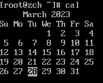
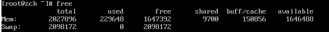
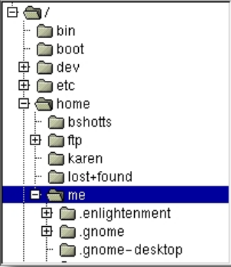
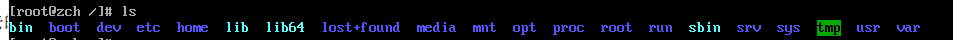
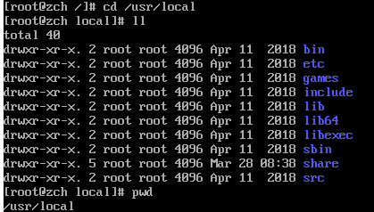
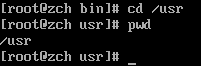
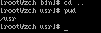

# 1、Linux简单命令

1、date

```shell
date
```


显示系统当前时间

2、cal

```shell
cal
```



默认显示当前月份的日历

3、df

```shell
df
```


查看磁盘剩余空间的数量

4、free

```shell
free
```



显示空闲内存的数量

# 2、结束终端对话

可以通过关闭终端窗口或者输入 `exit`来终止。即使终端仿真器没有运行，在后台仍然有几个终端会话运行，我们可以通过按 `ctrl + alt + f1` 到 `f6`切换，当一个会话被访问到时，会显示登录提示框。从一个虚拟控制台装换到另一个，使用 `alt + f1-f6`中的一个。

# 3、文件系统跳转

## 3.1理解文件系统树

类似于Windows，一个“类Unix”的操作系统，如Linux，以分层目录结构来阻止所有文件。这就意味着所有文件都形成了一颗树型目录（有时候在其它系统中叫做文件夹），这个目录树可能包含文件和其他的目录。文件系统的第一级目录称为根目录，根目录包含文件和子目录，子目录包含更多的文件和子目录，以此类推。

Windows每个存储设备都有独立的文件系统，Linux总是只有一个单一的文件系统树，不管多少磁盘或者存储连接到计算机上。根据系统管理员的想法，存储设备被挂载到目录树的各个节点上。

## 3.2当前工作目录



上面这是一张图形界面的目录树，通常命令行界面不会是这个样子的。

我们所在的目录称为**工作目录**，我们能知道父级目录以及各个子目录的路径，从而能去往各个地方。

使用 `pwd`显示当前工作目录。

```shell
pwd
```


当我们首次登录系统时，当前工作目录是我们的家目录，这里要注意，如果是 `#`则代表是管理员，`$`则代表是普通用户，普通用户只能在家目录写入文件。

## 3.3列出目录内容

列出一个目录包含的文件及子目录，使用 `ls`命令

```shell
ls
```



实际上，使用 `ls`命令可以列出任一个目录的内容，而不只是当前工作目录的内容。下一张深入了解。

## 3.4更改当前工作目录

更改工作目录，就需要使用 `cd`命令进行更改，cd后面加上路径名，这里的路径名可以是两种：**绝对路径**，**相对路径**。

### 3.4.1绝对路径

绝对路径开始于根路径，紧跟着目录树的分支往下，一直到达所期望的目录或文件。比如一个路径 `/usr/bin`，它意味着从根路径 `/`开始，有一个叫做 `usr`的目录包含了 `bin`。



### 3.4.2相对路径

相对路径和绝对路径不同，相对路径是从当前目录开始，我们在文件系统中使用一对特殊符号来标识相对位置。特殊符号为：`.`和 `..`。

`.`指的是工作目录，`..`指的是工作目录的父级目录。

比如我们现在切换到 `/usr/bin`，使用 `cd /usr/bin`

现在我们向切换到 `/usr`上，有两种方法：绝对路径或者相对路径

第一种：绝对路径 `cd /usr`



第二种：相对路径 `cd ..`



可见，两种方法实现的效果是一样的，但一般来讲肯定是使用输入最少的那个！

如果说我们现在在 `/usr`下，想要去 `/usr/bin`，也可以有两种方法：

第一种：绝对路径 `cd /usr/bin`

第二种：相对路径 `cd ./bin`，但是在这种情况下，完全可以用 `cd bin`代替，因为这里是隐含的。

## 3.5有用的快捷键

| 快捷键        | 运行结果                                              |
| ------------- | ----------------------------------------------------- |
| cd            | 更改工作目录到你的家目录                              |
| cd -          | 更改工作目录到先前的工作目录                          |
| cd ~user_name | 更改工作目录到用户家目录，例如 'cd ~aaa'会到aaa的目录 |

## 3.6关于文件名的重要规则

1、以 `.`字符开头的文件名是隐藏文件，这仅仅表示，使用 `ls`不能查看它们，需要使用 `ls -a`。当你创建账号时，有几个配置账号的隐藏文件被放在你的家目录下。另外，一些应用程序也会将隐藏文件放置在家目录下。

2、文件名和命令名是大小写敏感的。也就是说 ‘Field’ 和 ‘field’是两个不同的文件名。

3、Linux没有 “文件拓展名”的概念，可以使用你喜欢的名字来给文件起名。文件内容或用途由其他方法来决定。

4、虽然Linux支持长文件名，文件名可能包含空格，标点符号，但是标点符号仅限于用 '.' ，'-'，下划线。最重要的是，**不要在文件夹中使用空格**，如果你想表示词与词间的空格，用下划线来代替。
