# 9、权限

为了使多用户特性付诸实践，必须发明一种方法来组织用户彼此之间受到影响。毕竟，一个用户的行为不能导致计算机崩溃，也不能乱动属于另一个用户的文件。

和以下命令相关：

- `id` - 显示用户身份号
- `chmod` - 更改文件模式
- `umask` - 设置默认的文件权限
- `su` - 以另一个用户的身份来运行 `shell`
- `sudo` - 以另一个用户的身份来执行命令
- `chown` - 更改文件所有者
- `chgrp` - 更改文件组所有权
- `passwd` - 更改用户密码

## 9.1 拥有者、组成员和其他人

当我们想查看有些文件的时候，可能会有以下问题：

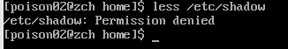

产生这种错误的原因是：作为一个普通用户，我们没有权限去读取这个文件。

在Unix安全模型中，一个用户可能拥有文件和目录。当一个用户拥有一个文件或目录时，用户对这个文件或目录的访问权限拥有控制权。用户反过来又属于一个或多个用户组成的用户组，用户组成员由文件和目录的所有者授予对文件和目录的访问权限。除了对一个用户组授予权限之外，文件所有者可能会给每个人一些权限，在Unix术语中，每个人是指整个世界。可以用 `id` 命令，来找到关于你自己身份的信息。

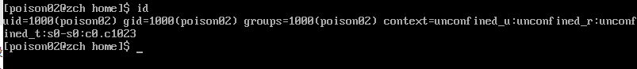

当用户创建账户之后，系统会给用户分配一个号码，叫做用户`ID`或者`uid`，然后，为了符合人类的习惯，这个ID被映射到一个用户名。系统优惠给这个用户分配一个原始的组ID或者是`gid`，这个gid可能属于另外的组。

用户账户定义在 `/etc/passwd` 文件里面，用户组定义在 `/etc/group`文件里面。当用户账户和用户组创建以后，这些文件随着文件 `/etc/shadow`的变动而修改，文件 `etc/shadow`包含了关于用户密码的信息。对于每个用户账户，文件 `/etc/passwd`定义了用户（登录）名、uid、gid、账号的真实姓名、家目录和登录shell。如果你查看一下文件 `/etc/passwd`和文件 `/etc/group`的内容，你会注意到除了普通用户账号之外，还有超级用户（uid 0）账号，和各种各样的系统用户。

## 9.2 读取、写入和执行

对于文件和目录的访问权力是根据读访问、写访问和执行访问来定义的。我们看一下ls命令的输出结果：

```sh
> foo.txt
ls -l foo.txt
```

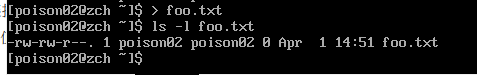

列表的前十个字符是文件的属性。这十个字符的第一个字符表名文件类型。下表是常见的文件类型：

| 属性 | 文件类型                                                     |
| ---- | ------------------------------------------------------------ |
| -    | 一个普通文件                                                 |
| d    | 一个目录                                                     |
| l    | 一个符号链接。注意对于读好链接文件，剩余的文件属性总是”rwxrwxrwx“，而且都是虚拟之。真正的文件属性是指符号链接所指向的文件的属性 |
| c    | 一个字符设备文件。这种文件类型是指按照字节流来处理数据的设备。比如说终端机或者调制解调器 |
| b    | 一个块设备文件。这种文件类型是指按照数据块来处理数据的设备，例如一个硬盘或者CD-ROM盘 |

剩下的就个字符叫做文件模式，代表着文件所有者、文件组所有者和其他人的读、写和执行权限。

| owner | group | world |
| ----- | ----- | ----- |
| rwx   | rwx   | rwx   |

当设置文件模式后，r、w、x模式属性对文件和目录会产生以下影响：

| 属性 | 文件                                                         | 目录                                                         |
| ---- | ------------------------------------------------------------ | ------------------------------------------------------------ |
| r    | 允许打开并读取文件内容                                       | 允许列出目录中的内容，前提是目录必须设置了可执行属性（x）    |
| w    | 允许写入文件内容或阶段文件。但是不允许对文件进行重命名或删除，重命名或删除是由目录的属性决定的 | 允许在目录下新建、删除或重命名文件，前提是目录必须设置了可执行属性（x） |
| x    | 允许将文件作为程序来执行，使用脚本语言编写的程序必须设置为可读才能被执行 | 允许进入目录，例如：`cd directory`                           |

下面是权限属性的一些例子：

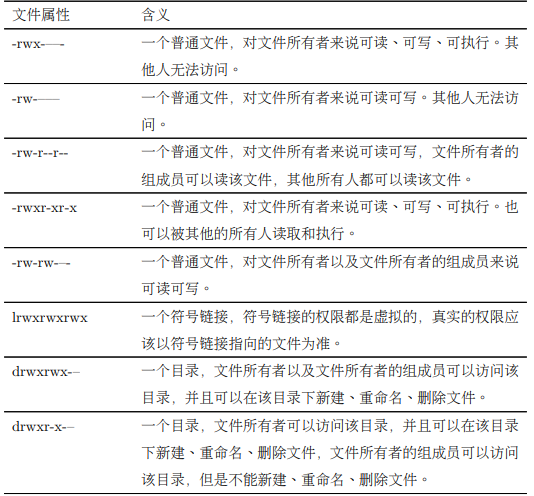

## 9.3 chmod - 更改文件模式

更改文件或目录的模式（权限），可以利用 `chmod` 命令。注意只有文件的所有者或者超级用户才能更改文件或目录的模式。`chmod`命令支持两种不同的方法来改变文件模式：八进制数字表示法或者符号表示法。首先我们讨论一下八进制数字表示法：

> 究竟什么是八进制？ 八进制（以 8 为基数）及其亲戚十六进制（以 16 为基数）都是数字系统，通常 被用来表示计算机中的数字。我们人类，因为（或者至少大多数人）天生有十个手 指的事实，利用以 10 为基数的数字系统来计数。计算机，从另一方面讲，生来只有 一个手指，因此它以二进制（以 2 为基数）来计数。它们的数字系统只有两个数值， 0 和 1。因此在二进制中，计数看起来像这样： 0, 1, 10, 11, 100, 101, 110, 111, 1000, 1001, 1010, 1011… 在八进制中，逢八进一，用数字 0 到 7 来计数，像这样： 0, 1, 2, 3, 4, 5, 6, 7, 10, 11, 12, 13, 14, 15, 16, 17, 20, 21… 十六进制中，使用数字 0 到 9，加上大写字母 “A” 到”F” 来计数，逢 16 进一： 0, 1, 2, 3, 4, 5, 6, 7, 8, 9, A, B, C, D, E, F, 10, 11, 12, 13… 虽然我们能知道二进制的意义（因为计算机只有一个手指），但是八进制和十六 进制对什么有好处呢？答案是为了人类的便利。许多时候，在计算机中，一小部分 数据以二进制的形式表示。以 RGB 颜色为例来说明。大多数的计算机显示器，每 个像素由三种颜色组成：8 位红色，8 位绿色，8 位蓝色。这样，一种可爱的中蓝色 就由 24 位数字来表示： 010000110110111111001101 我不认为你每天都喜欢读写这类数字。另一种数字系统对我们更有帮助。每个 十六进制数字代表四个二进制。在八进制中，每个数字代表三个二进制数字。那么 代表中蓝色的 24 位二进制能够压缩成 6 位十六进制数： 436FCD 因为十六进制中的两个数字对应二进制的 8 位数字，我们可以看到”43“代表红 色，“6F”代表绿色，“CD”代表蓝色。 现在，十六进制表示法（经常叫做“hex”）比八进制更普遍，但是我们很快会看 到，用八进制来表示 3 个二进制数非常有用处…

通过八进制表示法，我们使用八进制数字来设置所期望的权限模式。因为每个八进制数字代表了3个二进制数字，这种对应关系，正好映射到存储文件模式所使用的方案上。下标展示了我们要表达的意思：

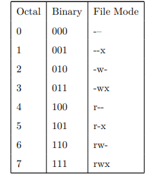

通过使用3个八进制数组，我们能够设置文件所有者、用户组和其他人的权限：

```sh
> foo.txt

ls -l foo.txt

chmod 600 foo.txt

ls -l foo.txt
```

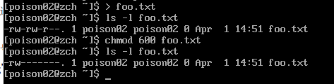

通过传递参数 600，我们能够设置文件所有者的权限为读写权限，而删除用户组和其他人的所有权限。虽然八进制到二进制的映射看起来不方便，但通常只会用到一些常见的映射关系：`7 (rwx)`，`6 (rw-)`，`5 (r-x)`，`4 (r--)`，和 `0 (-–)`。

`chmod`命令支持一种符号表示法，来指定文件模式。符号表示法分为三部分：更改会影响谁，要执行哪个操作，要设置哪种权限。通过以下字符指定要影响的对象：

| u    | `user` 的简写，意思是文件或目录的所有者 |
| ---- | --------------------------------------- |
| g    | 用户组                                  |
| o    | `others`的简写，意思是其他所有的人      |
| a    | `all`的简写，是u、g、o三者的联合        |

如果没有指定字符，则默认是 `all`。执行的操作可能是一个 `+`字符，表示加上一个权限，一个 `-`字符，表示删掉一个权限，或者是一个 `=`，表示只有指定的权限可用。其他所有的权限被删除。

权限由r、w、x来指定，下面是一个符号表示法的实例：

| `u + x`       | 为文件所有者添加可执行权限                                   |
| ------------- | ------------------------------------------------------------ |
| `u - x`       | 删除文件所有者的可执行权限                                   |
| `+x`          | 为文件所有者，用户组，和其他所有人添加可执行权限。等价于a + x |
| `o-rw`        | 除了文件所有者和用户组，删除其他人的读权限和写权限           |
| `go=rw`       | 给文件所属的组和文件所属者/组以外的人读写权限。如果文件所属组和其他人已经拥有执行的权限，之心该权限将被移除 |
| `u + x,go=rw` | 给文件拥有者执行权限并给组和其他人读和执行的权限。多种设定可以用逗号分开 |

符号表示法的优点是：允许你设置文件模式的某个属性，而不影响其他的属性。

## 9.4 umask - 设置默认权限

当创建一个文件时，`umask`命令控制着文件的默认权限。`umask`命令使用八进制表示法来表达从文件模式属性中删除一个位掩码。

```sh
rm -f foo.txt

umask

> foo.txt

ls -l foo.txt
```

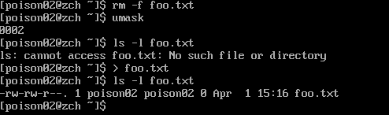

可以看到 `umask` 响应的数值是0002（0022是另一个常用值），这个数值是掩码的八进制表示形式。

接着重新创建 `foo.txt`，可以看到文件所有者和用户组都得到读和写权限，而其他人只是得到读权限。其他人没有得到写权限的原因是由掩码值决定的。

## 9.5 更改身份

在不同的时候，我们会发现很有必要具有另一个用户的身份。

- `su`
- `sudo`

### 9.5.1 su - 以其他用户身份和组ID运行一个shell

```sh
su [-[l]] [user]
```

如果包含一个 `-l`选项，那么会为指定用户启动一个需要登录的shell。这意味着会加载此用户的shell环境，并且公工作目录会更改到这个用户的家目录。如果不指定用户，则默认是超级管理员。注意，选项 `-l`可以缩写成 `-`。如果要启动超级管理员，我们可以这样做：

```sh
su -
```

工作完成后，输入 `exit`，则返回到原来的shell。

以这样的方式使用 `su` 命令，也可以只执行单个命令，而不是启动一个新的可交互的`shell`

```sh
su -c 'command'
```

使用这种模式，命令传递到一个新的shell中执行。把命令用单引号引起来很重要，因为我们不想命令在我们的shell中展开，但需要在新shell 中展开。

```sh
su -c 'ls -l /root/*'
```

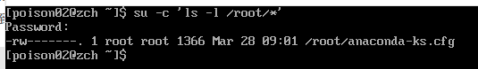

### 9.5.2 sudo - 以另一个用户身份执行命令

`su`和`sudo`很相似，但管理员能够配置`sudo`命令，从而允许一个普通用户以不同的身份（通常是超级用户），通过一种非常可控的方式来执行命令。尤其是，只有一个用户可以执行一个或多个特殊字符时。另一个差异是 `sudo`不要求超级用户的密码。使用 `sudo`命令时，用户使用他/她自己的密码来认证。

## 9.6 chown - 更改文件所有者和用户组

`chown` 命令被用来更改文件或目录的所有者和用户组。使用这个命令需要超级用户权限。`chown`命令的语法看起来像这样：

```sh
chown [owner][:[group]] file...
```

`chown` 可以根据这个命令的第一个参数更改文件所有者或文件用户组。例子：

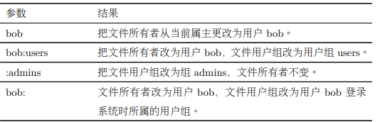

## 9.7 chgrp - 更改用户组所有权

`chgrp`和`chown`用起来很相似。

## 9.8 更改用户密码

使用 `passwd`设置或更改用户密码：

```sh
passwd [user]
```

只要输入 `passwd` 命令，就能更改你的密码。shell会提示你输入你的旧密码和你的新密码。

# 10、进程

现在的操作系统都支持多任务，意味着操作系统通过在一个执行中的程序和另一个程序之间快速切换造成了一种他同时能够做多件事情的假象。Linux内核通过使用进程来管理多任务。进程，就是Linux组织安排正在等待使用CPU的各种程序的方式。

- `ps` - 报告当前进程快照
- `top` - 显示任务
- `jobs` - 列出活跃的任务
- `bg` - 把一个任务放在后台执行
- `fg` - 把一个任务放到前台执行
- `kill` - 给一个进程发送信号
- `killall` - 杀死指定名字的进程
- `shutdown` - 关机或重启系统

## 10.1 进程是怎样工作的？

当系统启动时，内核先把一些他自己的活动初始化为进程，然后运行一个叫做 `init` 的程序。依次地，在运行一系列的称为 `init` 脚本的shell脚本（位于 `/etc`），他们可以启动所有的系统服务。其中许多系统服务以守护（daemon）程序的形式实现，守护程序仅在后台运行，没有任何用户接口。这样，即使我们没有登录系统，至少系统也在忙于执行一些例行事务。

在进程方案中，一个程序可以发动另一个程序被表述为一个父进程可以产生一个子进程。 内核维护每个进程的信息，以此来保持事情有序。例如，系统分配给每个进程一个数字，这 个数字叫做进程 (process) ID 或 `PID`。`PID` 号按升序分配，`init` 进程的 `PID` 总是 1。内核也对 分配给每个进程的内存和就绪状态进行跟踪以便继续执行这个进程。像文件一样，进程也有所 有者和用户 ID，有效用户 ID，等等。

## 10.2 查看进程

最常使用的命令是 `ps`（process status）。

```sh
ps
```

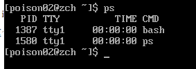

上面中，各自列出了两个进程，进程1387和1580，分别表示命令 `bash` 和 `ps`。正如我们所看到的。默认情况下，`ps`不会显示很多进程信息，只是列出与当前终端会话相关的进程。

我们可以加上一些其他字段，`TTY`（Teletype）的简写，是指进程的控制终端，`TIME`字段表示进程所消耗的CPU时间数量。

```sh
ps x
```

加上 `x` 选项，告诉 `ps`命令，展示所有进程，不管他们由什么终端控制。

可以看到 `STATE` 属性：

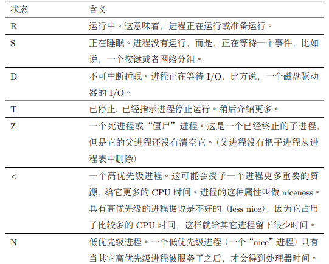

```sh
ps aux
```

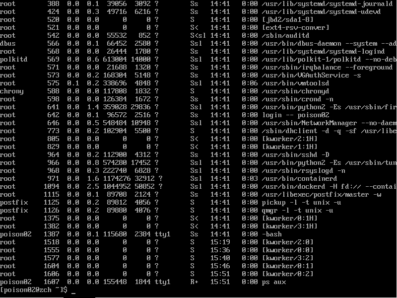

这个选项组合，能够显示属于每个用户的进程信息。使用这个选项，可以唤醒"BSD风格”的输出结果。

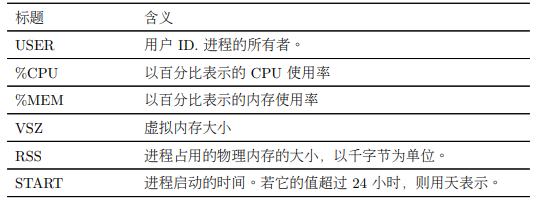

## 10.3 用 top 命令动态查看进程

```sh
top
```

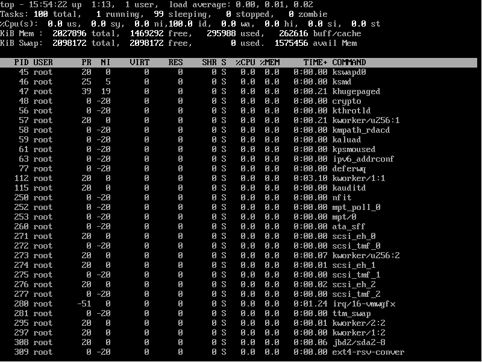

top 程序以进程活动顺序显示连续更新的系统进程列表。（默认情况下，每三秒钟更新一次）， “top” 这个名字来源于 top 程序是用来查看系统中“顶端”进程的。top 显示结果由两部分组 成：最上面是系统概要，下面是进程列表，以 CPU 的使用率排序。

下图是对系统概要的说明：

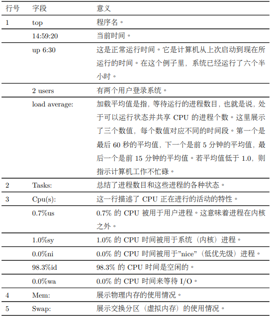

`top`命令接收一系列从键盘输入的命令。两个最有趣的命令是 `h` 和 `q`。h是显示程序的帮助屏幕，q退出top程序。

## 10.4 控制进程

我们可以用一个叫做 `xlogo`的小程序，作为我们的实验品。这是 X 窗口程序

## 10.5 中断一个进程

输入 `ctrl + c`中断程序。

## 10.6 把一个进程放置到后台执行

```sh
xlogo &
```

## 10.7 杀死进程

使用 `kill` 命令